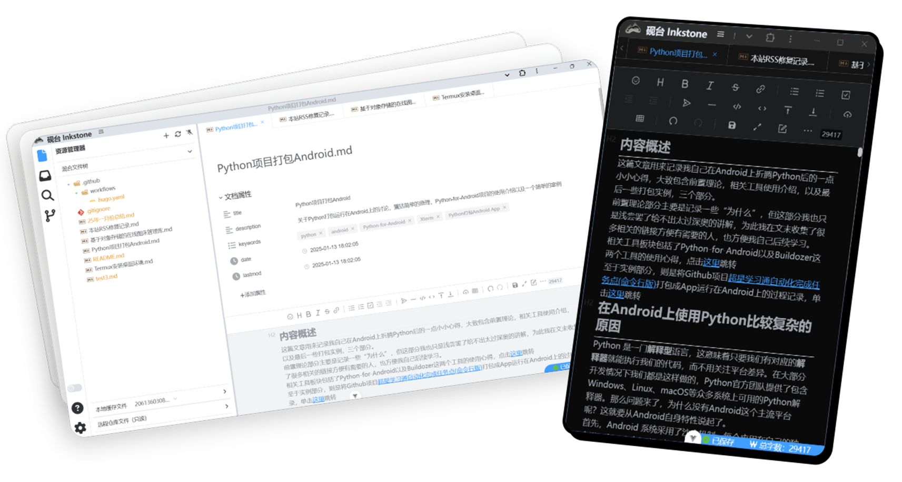

    
    

    
    
    
    
    
    
    

<h1>相关文档请见官网: <a href="https://inkstone.work" target="_blank">https://inkstone.work</a></h1>

# 砚台/InkStone

## 💡 介绍

**砚台** 是一款由 Vue 开发的Markdown编辑器。虽然这是一个很新的项目很多功能仍然有待完善中，但是依赖于`Vidtor编辑器`和`Codemirror编辑器`砚台能够提供可靠舒适的Markdown体验以及完成轻量的代码编辑浏览工作。同时依赖于最新的Web标准，砚台在提供不输于原生应用的前提下，本身只是一款纯前端的Web应用，方便部署的同时还能再任意设备平台上使用。

    <a href="docs/screenshots.md">@更多截图</a>

### 体验地址

[Vercel](https://dev.inkstone.work)

## ✨ 特性

| 特性                                                                                                                            | InkStone        | Typora          | Visual Studio Code (VSCode)   |
| ------------------------------------------------------------------------------------------------------------------------------- | --------------- | --------------- | ----------------------------- |
| **主要功能**                                                                                                                    | Markdown 编辑器 | Markdown 编辑器 | 通用代码编辑器，支持 Markdown |
| **即时渲染模式**                                                                                                                | ✔️              | ✔️              | 通过插件支持                  |
| **所见即所得模式**                                                                                                              | ✔️              | ✔️              | 通过插件支持                  |
| **分屏预览模式**                                                                                                                | ✔️              | ✔️              | 通过插件支持                  |
| **文件管理**                                                                                                                    | ✔️              | ✔️              | ✔️                            |
| 大纲、数学公式、脑图、图表、流程图、甘特图、时序图、五线谱、多媒体、语音阅读、标题锚点、代码高亮及复制、graphviz、PlantUML 渲染 | ✔️              | ✔️              | 通过插件支持                  |
| **插件支持**                                                                                                                    | ❌              | ✔️              | ✔️                            |
| **主题和样式**                                                                                                                  | 即将支持        | ✔️              | ✔️                            |
| **代码高亮**                                                                                                                    | ✔️              | ✔️              | ✔️                            |
| **快捷键**                                                                                                                      | ✔️              | ❌              | ✔️                            |
| **自定义快捷键**                                                                                                                | 即将支持        | ✔️              | ✔️                            |
| **多标签页支持**                                                                                                                | ✔️              | ✔️              | ✔️                            |
| **跨平台支持**                                                                                                                  | PC+移动全平台   | 仅PC            | 仅PC                          |
| **Github集成**                                                                                                                  | ✔️              | ❌              | ✔️                            |
| **体积**                                                                                                                        | 超轻量          | 轻量            | 较大                          |
| **代码编辑**                                                                                                                    | ✔️              | ❌              | ✔️                            |
| **费用**                                                                                                                        | 开源免费        | ❌              | 开源免费                      |
| **图床**                                                                                                                        | 内置图床管理    | ✔️              | 插件支持                      |
| **可视化编辑 Yaml Front Matter**                                                                                                | ✔️              | ❌              | ❌                            |

## 使用场景

1. 安装Pwa后作为本地Markdown编辑器
2. 作为在线代码编辑器简单编辑Github仓库代码（类似dev.github.com）
3. 在移动设备上安装后充当PC端Markdown编辑器的补充
4. 随个人静态博客一起发布作为博客编辑后端

## ✅预计开发任务

- [x] 迁移整理图标相关代码
- [x] GitHub 拉取/提交文件策略更新
- [x] 文件管理器优化，外观，功能
- [ ] 主题统一，支持切换
- [x] 允许加载/保存全局配置
- [x] 编辑器添加处理格式字符串的功能
- [x] 事件总线完善
- [x] 更加完整的底部状态条功能
- [x] 提供更多登录方式,注册成为 GitHub App
- [x] 大纲列表
- [x] 搜索列表
- [x] 更完整的设置面板，支持更多可选项配置
- [x] 图床开发
- [x] 适配 history 和 hash 两种模式
- [ ] 自定义 Github 接口代理
- [x] 重构css样式，更换sass语法。添加夜间模式支持
- [x] 重构组件代码，分离混合搅乱的部分
- [x] 添加按需导入，分片打包。优化加载速度
- [ ] 添加更加实用的图床管理功能
- [ ] 添加Wasm本地处理图片的能力
- [x] Pwa优化，向本地编辑器功能看齐
- [x] 完善现有的Codemirror编辑器功能
- [x] 修复编辑器全屏Bug
- [ ] Front Matter 可视化编辑改为可选
- [ ] 修复个人Token登录流程

> 如有新的需求或者急需上述某个功能可在 issue 中提出

## 获取进阶能力

**砚台** 是一款渐进式网页应用，你可以通过安装得到如下更加舒适的体验：
1. 趋于原生的标题栏
2. 设置为系统打开Markdown文件的默认应用
3. 完全离线使用（数据将会被缓存，断网可用）

## 🛠️ 开发/自部署

**砚台** 是一个完全的前端应用程序不含有任何后端内容，部署它的要求非常低。如果你有服务器直接复制打包内容到服务器上即可且仅需要8Mb的存储空间。如果没有也没有关系Github Pages、COS、Vercel等平台均可部署 **砚台**

自行打包运行步骤（Vite项目打包通用步骤）

1. clone项目到本地
2. 使用`pnpm install`安装依赖
3. `pnpm run dev / pnpm build`运行或打包

## 📄 授权

InkStone 使用 MIT 开源协议。

## 🙏 鸣谢

**Vditor**：是一款浏览器端的 Markdown 编辑器，支持所见即所得、即时渲染（类似 Typora）和分屏预览模式。它使用 TypeScript 实现，支持原生 JavaScript 以及 Vue、React、Angular 和 Svelte 等框架。

**Vue**：Vue (pronounced /vjuː/, like view) is a progressive framework for building user interfaces.

**Lute**：🎼 一款结构化的 Markdown 引擎，支持 Go 和 JavaScript

**highlight.js**：JavaScript syntax highlighter

**mermaid**：Generation of diagram and flowchart from text in a similar manner as Markdown

**incubator-echarts**：A powerful, interactive charting and visualization library for browser

**abcjs**：JavaScript library for rendering standard music notation in a browser
