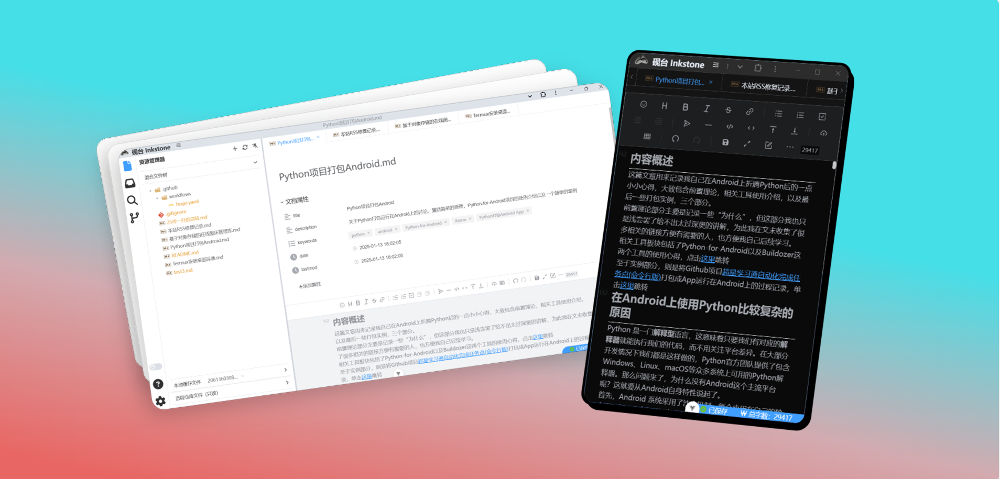

<small>1.0</small>

> 为**静态博客**作者精细设计的在线文章管理器

- 三种 Markdown 编辑模式
- Github 实现多端同步数据
- 内置图床管理
- 离线使用，原生应用体验

[GitHub](https://github.com/2061360308/inkstone/)
[在线Demo](https://app.inkstone.work/)
[快速开始](getting-started)

<!-- background image -->

